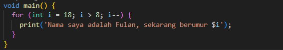
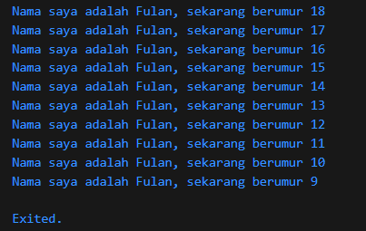

# Pertemuan 2

### Nama    : Ahmed Fathir Syafaat
### Kelas   : TI - 3H
### NIM     : 2241720083

1. Soal 1
> Kode Program 

> Output 

2. Soal 2
> Memahami bahasa pemrograman Dart sangat penting sebelum menggunakan Flutter karena Flutter dibangun sepenuhnya di atas Dart. Menguasai Dart dapat memahami sintaks dasar, konsep OOP, dan fitur penting seperti asynchronous programming, yang semuanya digunakan secara luas dalam pengembangan Flutter. Selain itu, pemahaman Dart membantu dalam debugging, optimasi kode, dan penggunaan paket serta plugin. Dengan mengetahui dasar Dart akan lebih mudah menulis kode yang efisien dan memaksimalkan potensi framework Flutter dalam membangun aplikasi mobile.

3. Soal 3
> Dart adalah Bahasa pemrograman yang dikembangkan oleh Google, awalnya sebagai alternatif JavaScript.

> Dart dipilih karena kemampuannya untuk mengompilasi ke berbagai platform dan mendukung fitur hot reload.

> Fitur utamanya antara lain: Type safety, null safety, fleksibilitas tipe, isolat untuk paralelisme, dan package manager Pub.

> Mendukung pemrograman fungsional dan OOP dengan mixin-based inheritance.
 
> Dart fleksibel dan produktif, ideal untuk pengembangan lintas platform. 