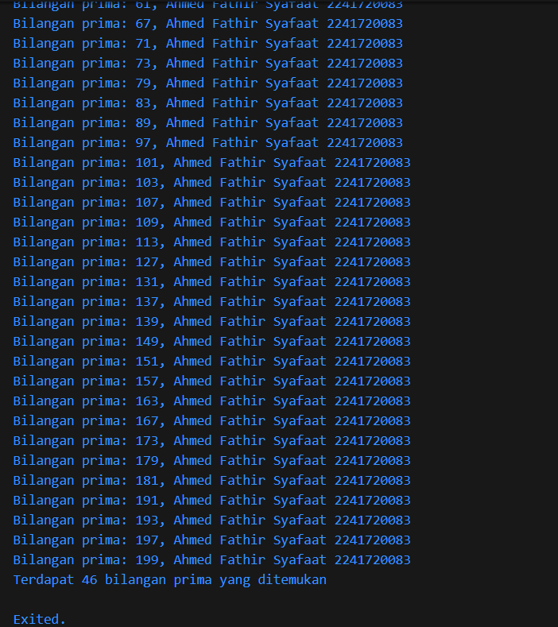

Nama    : Ahmed Fathir Syafaat
Kelas   : TI - 3H
NIM     : 2241720083

## Pertemuan 3

1. Silakan selesaikan Praktikum 1 sampai 3, lalu dokumentasikan berupa screenshot hasil pekerjaan beserta penjelasannya!
### Praktikum 1 | Menerapkan Control Flows ("if/else")
#### Langkah 1:


#### Langkah 2:

> Error tersebut muncul karena penulisan yang salah pada kata kunci else if. Seharusnya penulisan else if dalam Dart menggunakan huruf kecil semuanya, tetapi di kode kamu tertulis sebagai else If (huruf I kapital). Dart adalah bahasa pemrograman yang case-sensitive, artinya membedakan huruf besar dan kecil.

#### Langkah 3:

> Akan muncul error karena kondisi dalam pernyataan if (test) mengharapkan tipe data bool (boolean), namun test diinisialisasi sebagai string, yaitu "true". Dalam Dart, sebuah if statement hanya bisa mengevaluasi nilai boolean seperti true atau false, tetapi dalam kode kamu, variabel test adalah string dan bukan boolean.

- Jika terjadi error, silakan perbaiki namun tetap menggunakan if/else.
```
void main() {
  String test = "test2";
  if (test == "test1") {
    print("Test1");
  } else if (test == "test2") {
    print("Test2");
  } else {
    print("Something else");
  }

  if (test == "test2") print("Test2 again");

  test = "true";
  if (test == "true") {
    print("Kebenaran");
  }
}

```


### Praktikum 2: Menerapkan Perulangan "while" dan "do-while"
#### Langkah 1:


#### Langkah 2:

> Error yang muncul disebabkan oleh fakta bahwa variabel counter belum dideklarasikan di dalam kode. Dart memerlukan setiap variabel yang digunakan di dalam suatu blok kode untuk didefinisikan terlebih dahulu sebelum digunakan.

- Lalu perbaiki jika terjadi error.
```
void main() {
  int counter = 30;

  while (counter < 33) {
    print(counter);
    counter++;
  }
}
```


#### Langkah 3:
```
void main() {
  int counter = 70;

  while (counter < 33) {
    print(counter);
    counter++;
  }

  do {
    print(counter);
    counter++;
  } while (counter < 77);
}
```
- Tidak terjadi error karena counter sudah dideklarasikan pada langkah 2, pada langkah 3 ini hanya mengganti nilai counternya


### Praktikum 3: Menerapkan Perulangan "for" dan "break-continue"
#### Langkah 1:


#### Langkah 2:

> Error terjadi karena perbedaan penggunaan huruf besar dan kecil pada variabel Index dan index, sedangkan Dart membedakan huruf besar dan kecil (case-sensitive). Selain itu, di dalam for-loop, variabel index tidak mengalami penambahan (increment) setelah setiap iterasi, sehingga loop tidak akan berjalan dengan benar. Untuk memperbaikinya, variabel harus dideklarasikan dengan konsisten (misalnya index) dan tambahkan index++ untuk menaikkan nilainya di setiap putaran.

- Lalu perbaiki jika terjadi error.
```
void main() {
  for (int index = 10; index < 27; index++) {
    print(index);
  }
}
```


#### Langkah 3:

> Kode tersebut memiliki beberapa kesalahan sintaksis dan logika. Kata kunci If dan Else If harus ditulis dengan huruf kecil (if dan else if). Pernyataan break dan continue hanya boleh digunakan di dalam loop. Selain itu, penulisan variabel harus konsisten (index bukan Index). Terakhir, print(index) yang kedua tidak akan dieksekusi karena berada di luar loop. Perbaikan meliputi penggunaan huruf kecil untuk kata kunci dan penempatan break serta continue di dalam loop.

- Jika terjadi error, silakan perbaiki namun tetap menggunakan for dan break-continue
```
void main() {
  for (int index = 10; index < 27; index++) {
    print(index);
    if (index == 21) {
      break;
    } else if (index > 1 || index < 7) {
      continue;
    }
    print(index);
  }
}
```


2. Buatlah sebuah program yang dapat menampilkan bilangan prima dari angka 0 sampai 201 menggunakan Dart. Ketika bilangan prima ditemukan, maka tampilkan nama lengkap dan NIM Anda.
```
void main() {
  String nama = "Ahmed Fathir Syafaat";
  String nim = "2241720083";
  int jumlahPrima = 0;
  int angka = 0;

  while (angka <= 201) {
    if (angka < 2) {
      angka++;
      continue;
    }

    bool bilPrima = true;

    for (int i = 2; i <= angka ~/ 2; i++) {
      if (angka % i == 0) {
        bilPrima = false;
        break;
      }
    }

    if (bilPrima) {
      print("Bilangan prima: $angka, $nama $nim");
      jumlahPrima++; 
    }

    angka++;
  }
  
  print("Terdapat $jumlahPrima bilangan prima yang ditemukan");
}
```


